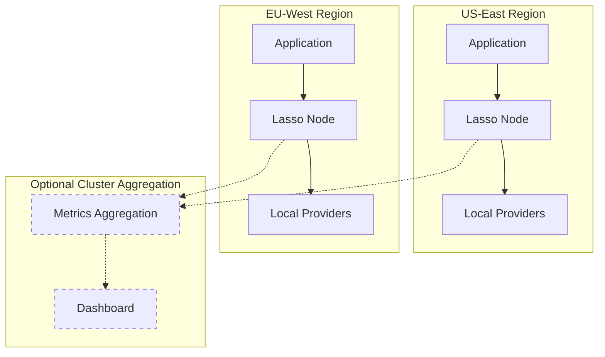

## System Overview

Lasso RPC is an Elixir/OTP application that provides blockchain RPC provider orchestration with intelligent routing, circuit breaker protection, and real-time observability.

### Core Design Principles

**Geo-Distributed Independence**
- Each Lasso node operates autonomously with complete, isolated supervision trees
- Routing decisions based on local latency measurements only
- No cluster coordination in the request hot path
- Single nodes work standalone without clustering

**Multi-Profile Isolation**
- Independent routing configurations per profile
- Isolated metrics and circuit breakers per `(profile, chain)` pair
- Shared provider infrastructure for efficiency

**Transport-Agnostic Routing**
- Unified pipeline routes across HTTP and WebSocket
- Real-time performance-based transport selection
- Method-specific benchmarking per transport

## Geo-Distributed Proxy Design

Lasso is designed for global deployments where each node serves traffic from its region while optionally sharing observability data.



### Regional Latency Awareness

Provider performance varies significantly by geography. Lasso's passive benchmarking reveals which providers are fastest from each region:

- Applications connect to their nearest Lasso node
- Each node independently measures provider latency
- Routing optimizes for regional performance

### Observability-First Clustering

When enabled, clustering aggregates metrics for operational visibility without impacting routing:

```bash
# Enable clustering with DNS-based discovery
export CLUSTER_DNS_QUERY="lasso.internal"
export LASSO_NODE_ID="us-east-1"
```

**Clustering provides:**
- Unified dashboard view across regions
- Per-region provider performance comparison
- Topology monitoring (node health)
- **No routing impact** - clustering is purely observational

## OTP Supervision Architecture

The supervision tree provides fault tolerance through hierarchical process supervision:

```
Lasso.Application
├── Phoenix.PubSub (cluster messaging)
├── Finch (HTTP connection pools)
├── Cluster.Supervisor (libcluster node discovery)
├── Task.Supervisor (async operations)
├── Lasso.Cluster.Topology (cluster membership & health)
├── Lasso.Benchmarking.BenchmarkStore (latency metrics)
├── Lasso.Benchmarking.Persistence (metrics history)
├── Lasso.Config.ConfigStore (profile configuration)
├── LassoWeb.Dashboard.MetricsStore (cluster metrics cache)
├── Lasso.Dashboard.StreamSupervisor (DynamicSupervisor)
│   └── EventStream {profile} (real-time dashboard)
├── Lasso.Providers.InstanceDynamicSupervisor
│   └── InstanceSupervisor {instance_id}
│       ├── CircuitBreaker {instance_id, :http}
│       ├── CircuitBreaker {instance_id, :ws}
│       ├── WSConnection {instance_id}
│       └── InstanceSubscriptionManager {instance_id}
├── Lasso.Providers.ProbeSupervisor (DynamicSupervisor)
│   └── ProbeCoordinator {chain}
├── Lasso.BlockSync.DynamicSupervisor
│   └── BlockSync.Worker {chain, instance_id}
├── ProfileChainSupervisor (DynamicSupervisor)
│   └── ChainSupervisor {profile, chain}
│       ├── TransportRegistry
│       ├── ClientSubscriptionRegistry
│       ├── UpstreamSubscriptionPool
│       └── StreamSupervisor
│           └── StreamCoordinator {subscription_key}
└── LassoWeb.Endpoint (Phoenix HTTP/WS)
```

### Key Components

#### Provider Instance Management

**Lasso.Providers.Catalog**
- Pure module (not GenServer) for O(1) provider lookups
- Maps profiles to shared provider instances
- Builds ETS catalog from ConfigStore, swaps via `persistent_term` atomically
- Instance deduplication: same URL + chain = same instance across profiles

**Lasso.Providers.InstanceSupervisor**
- Per-instance supervisor for shared infrastructure
- Started under `InstanceDynamicSupervisor`
- Children: CircuitBreaker (HTTP), CircuitBreaker (WS), WSConnection, InstanceSubscriptionManager
- Shared across all profiles using the same upstream

#### Health Monitoring

**Lasso.Providers.ProbeCoordinator**
- Per-chain health probe coordinator (one per unique chain)
- 200ms tick cycle with exponential backoff on failures
- Probes one instance per tick to avoid thundering herd
- Writes health status to `:lasso_instance_state` ETS

**Backoff Schedule:**

| Consecutive Failures | Backoff |
|---------------------|----------|
| 0-1 | 0 (probe on next tick) |
| 2 | 2 seconds |
| 3 | 4 seconds |
| 4 | 8 seconds |
| 5 | 16 seconds |
| 6+ | 30 seconds (capped) |

#### Provider Selection

**Lasso.Providers.CandidateListing**
- Pure ETS reads (no GenServer) for minimal latency
- 7-stage filter pipeline (see [Provider Selection](/concepts/provider-selection))
- Returns candidates with availability, circuit state, and rate limit status

#### Profile-Scoped Supervision

**ProfileChainSupervisor**
- Top-level dynamic supervisor for `(profile, chain)` pairs
- Enables independent lifecycle per configuration
- Hot-add/remove chains without restarts

**ChainSupervisor**
- Per-`(profile, chain)` supervisor providing policy isolation
- Children:
  - **TransportRegistry**: HTTP/WS channel discovery
  - **ClientSubscriptionRegistry**: WebSocket fan-out to clients
  - **UpstreamSubscriptionPool**: Multiplexes client subscriptions
  - **StreamSupervisor**: Per-subscription continuity management

## Profile System

Multi-tenancy via profiles enables isolated routing configurations:

```yaml
name: "Lasso Public"
slug: "default"
rps_limit: 100
burst_limit: 500

chains:
  ethereum:
    chain_id: 1
    monitoring:
      probe_interval_ms: 12000
    providers:
      - id: "ethereum_llamarpc"
        url: "https://eth.llamarpc.com"
        ws_url: "wss://eth.llamarpc.com"
```

### URL Routing

```bash
# Profile-aware routes
POST /rpc/profile/:profile/:chain
POST /rpc/profile/:profile/fastest/:chain

# Default profile (uses "default" slug)
POST /rpc/:chain
POST /rpc/fastest/:chain
```

### Profile Isolation

Each `(profile, chain)` pair runs in an isolated supervision tree:

- Independent circuit breakers
- Isolated metrics and benchmarking
- Separate rate limits
- Dedicated WebSocket subscriptions

**Shared Infrastructure:**
- Provider instances (URL + chain hash)
- Circuit breakers (shared across profiles)
- WebSocket connections (shared across profiles)
- Block height tracking (shared across profiles)

## Block Height Monitoring

Lasso tracks blockchain state using a dual-strategy approach:

### HTTP Polling (Always Running)

- Bounded observation delay (`probe_interval_ms`)
- Reliable foundation for lag calculation
- Continues during WebSocket failures

### WebSocket Subscription (Optional)

- Sub-second block notifications when healthy
- Degrades gracefully to HTTP on failure
- Provider-specific via `subscribe_new_heads: true`

**BlockSync.Worker** manages per-`(chain, instance_id)` tracking:

```elixir
# Registry key structure
{:height, chain, instance_id} => {height, timestamp, source, metadata}

# Example
{:height, "arbitrum", "drpc"} => {421_535_503, 1736894871234, :http, %{latency_ms: 45}}
```

### Optimistic Lag Calculation

Compensates for observation delay on fast chains:

```elixir
elapsed_ms = now - timestamp
block_time_ms = Registry.get_block_time_ms(chain) || config.block_time_ms
staleness_credit = min(div(elapsed_ms, block_time_ms), div(30_000, block_time_ms))
optimistic_height = height + staleness_credit
optimistic_lag = optimistic_height - consensus_height
```

**Example** (Arbitrum - 250ms blocks, 2s poll):

```
reported_height: 421,535,503
consensus_height: 421,535,511
raw_lag: -8 blocks

elapsed: 2000ms → credit: 2000/250 = 8 blocks
optimistic_height: 421,535,503 + 8 = 421,535,511
optimistic_lag: 0 blocks ✓
```

## WebSocket Subscription Management

Intelligent multiplexing with automatic failover:

```
Client (Viem/Wagmi)
     ↓
RPCSocket (Phoenix Channel)
     ↓
SubscriptionRouter
     ↓
UpstreamSubscriptionPool (multiplexing)
     ↓
WSConnection (upstream provider)
     ↓
StreamCoordinator (per-subscription key)
     ↓
├─→ GapFiller (HTTP backfill)
└─→ ClientSubscriptionRegistry (fan-out)
```

### Multiplexing

100 clients subscribing to `eth_subscribe("newHeads")` share a single upstream subscription.

### Failover with Gap-Filling

On provider failure mid-stream:

1. StreamCoordinator detects failure
2. Computes gap: `last_seen_block` to current head
3. GapFiller backfills missed blocks via HTTP
4. Injects backfilled events into stream
5. Subscribes to new provider

Clients receive continuous event stream without gaps.

## Cluster Topology & Aggregation

When BEAM clustering is enabled, nodes form a topology-aware cluster:

### Node Lifecycle States

| State | Description |
|-------|-------------|
| `:connected` | Erlang distribution established |
| `:discovering` | Region identification in progress |
| `:responding` | Passes health checks, region known |
| `:unresponsive` | Connected but failing health checks |
| `:disconnected` | Previously connected, now offline |

### Dashboard Event Streaming

**EventStream** aggregates real-time events for dashboard LiveViews:

- Subscribes to: topology changes, routing decisions, circuit events, block sync
- Batches events (50ms intervals, max 100 per batch)
- Computes per-provider metrics grouped by region
- Broadcasts to LiveView subscribers

**MetricsStore** caches cluster-wide metrics:

```elixir
MetricsStore.get_provider_leaderboard("default", "ethereum")
# => %{data: [...], coverage: %{responding: 3, total: 3}, stale: false}
```

- **Cache TTL**: 15 seconds
- **RPC timeout**: 5 seconds
- **Aggregation**: Weighted averages by call volume

## Performance Characteristics

### Overhead

| Operation | Latency | Notes |
|-----------|---------|-------|
| Context creation | &lt;1ms | Single struct allocation |
| Provider selection | 2-5ms | ETS lookups + scoring |
| Benchmarking update | &lt;1ms | Async ETS write |
| Circuit breaker check | &lt;0.1ms | GenServer call |
| Request observability | &lt;5ms | Async logger |
| **Total overhead** | **~10ms** | End-to-end added latency |

### Scalability

- **Concurrent requests**: 10,000+ simultaneous (BEAM lightweight processes)
- **Subscriptions per upstream**: 1,000+ clients per upstream subscription
- **Memory per request**: &lt;1KB (RequestContext + temporary state)
- **ETS table scans**: &lt;1ms P99 (consensus height calculation)

## Configuration

Profiles are loaded from `config/profiles/*.yml`:

```bash
# Single node (default)
No additional configuration needed

# Multi-node cluster
export CLUSTER_DNS_QUERY="lasso.internal"
export LASSO_NODE_ID="us-east-1"
```

See [Profiles](/concepts/profiles) for detailed configuration options.

## Next Steps

<CardGroup cols={2}>
  <Card title="Routing Strategies" icon="route" href="/concepts/routing-strategies">
    Learn about :fastest, :load_balanced, and :latency_weighted routing
  </Card>
  <Card title="Provider Selection" icon="filter" href="/concepts/provider-selection">
    Understand the 7-stage filter pipeline
  </Card>
  <Card title="Circuit Breakers" icon="shield-halved" href="/concepts/circuit-breakers">
    Explore fault tolerance and automatic recovery
  </Card>
  <Card title="Profiles" icon="users" href="/concepts/profiles">
    Configure multi-tenant routing policies
  </Card>
</CardGroup>