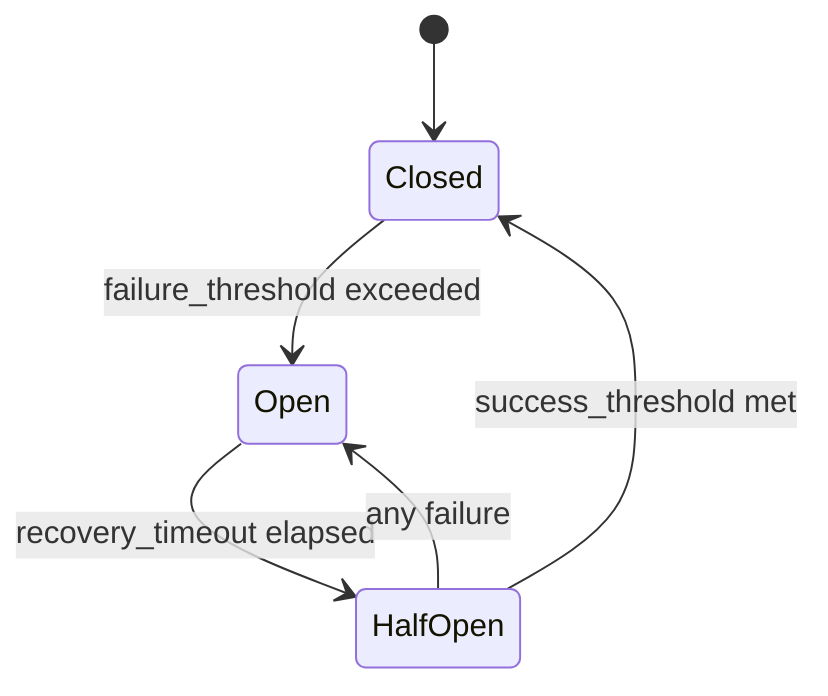

## Overview

Circuit breakers prevent cascade failures by tracking provider health and automatically stopping traffic to failing providers. Lasso implements per-provider, per-transport circuit breakers with automatic recovery and exponential backoff.

## State Machine

Circuit breakers operate in three states:



### State Descriptions

**:closed** (Healthy)
- Provider is operating normally
- All requests are allowed
- Failures increment counter but don't block traffic
- Transitions to `:open` after `failure_threshold` consecutive failures

**:open** (Failing)
- Provider has exceeded failure threshold
- All requests are **rejected** immediately
- No traffic sent to provider
- Transitions to `:half_open` after `recovery_timeout` elapsed

**:half_open** (Recovering)
- Provider is testing recovery
- Limited concurrent requests allowed (`half_open_max_inflight`)
- Success increments recovery counter
- Any failure immediately reopens circuit
- Transitions to `:closed` after `success_threshold` consecutive successes

## Circuit Breaker Keying

Circuit breakers are keyed by `{instance_id, transport}` where:

```elixir
instance_id = :crypto.hash(:sha256, "#{chain}:#{url}:#{auth_hash}")
             |> Base.encode16(case: :lower)
transport = :http | :ws
```

**Key Properties:**
- Same provider instance shared across profiles
- Independent circuit breakers for HTTP and WebSocket
- Deduplication prevents redundant circuit state

**Example**:
```
Profile A: uses https://eth.llamarpc.com → instance_id: "abc123"
Profile B: uses https://eth.llamarpc.com → instance_id: "abc123" (same)

Circuit Breakers:
- {:circuit_breaker, "abc123:http"} (shared)
- {:circuit_breaker, "abc123:ws"} (shared)
```

## Configuration

Circuit breaker behavior is configured via application config:

```elixir
config :lasso, :circuit_breaker,
  failure_threshold: 5,        # Consecutive failures before opening
  success_threshold: 2,        # Consecutive successes to close
  recovery_timeout: 60_000,    # Base recovery timeout in ms (1 minute)
  max_recovery_timeout: 600_000,  # Maximum timeout (10 minutes)
  half_open_max_inflight: 3,   # Max concurrent requests in half-open
  category_thresholds: %{
    server_error: 5,
    network_error: 3,
    timeout: 2,
    auth_error: 2
  }
```

### Configuration Parameters

**failure_threshold** (default: 5)
- Consecutive failures required to open circuit
- Lower values = more aggressive protection
- Higher values = more tolerance for transient failures

**success_threshold** (default: 2)
- Consecutive successes required to close from half-open
- Lower values = faster recovery
- Higher values = more conservative recovery

**recovery_timeout** (default: 60,000ms)
- Base timeout before attempting recovery
- Applies to first open episode
- Subsequent reopens use exponential backoff

**max_recovery_timeout** (default: 600,000ms)
- Maximum timeout after exponential backoff
- Prevents unbounded backoff
- Caps at 10 minutes by default

**half_open_max_inflight** (default: 3)
- Maximum concurrent requests in half-open state
- Limits blast radius during recovery testing
- Excess requests rejected with `:half_open_busy`

**category_thresholds** (optional)
- Per-error-category failure thresholds
- Overrides `failure_threshold` for specific error types
- Example: Open faster on network errors (3) than server errors (5)

## State Transitions

### Closed → Open

Triggered when consecutive failures reach threshold:

```elixir
new_failure_count = state.failure_count + 1
threshold = Map.get(state.category_thresholds, error_category, state.failure_threshold)

if new_failure_count >= threshold do
  # Compute recovery deadline with jitter
  delay = state.base_recovery_timeout
  delay_with_jitter = add_jitter(delay)
  
  # Schedule proactive recovery timer
  timer_ref = Process.send_after(self(), {:attempt_proactive_recovery, gen}, delay_with_jitter)
  
  # Update state
  %{state |
    state: :open,
    failure_count: new_failure_count,
    last_failure_time: now,
    recovery_timer_ref: timer_ref,
    recovery_deadline_ms: now + delay_with_jitter,
    effective_recovery_delay: delay,
    last_open_error: extract_error_info(error)
  }
end
```

**Telemetry Event**:
```elixir
:telemetry.execute([:lasso, :circuit_breaker, :open], %{count: 1}, %{
  instance_id: instance_id,
  transport: transport,
  from_state: :closed,
  to_state: :open,
  reason: :failure_threshold_exceeded,
  error_category: :server_error,
  failure_count: 5,
  recovery_timeout_ms: 60_000
})
```

### Open → Half-Open

Triggered by recovery timeout or traffic-triggered recovery:

**Proactive Recovery** (timer-based):
```elixir
handle_info({:attempt_proactive_recovery, gen}, state) do
  case state.state do
    :open ->
      %{state |
        state: :half_open,
        success_count: 0,
        inflight_count: 0,
        recovery_timer_ref: nil
      }
    _ ->
      state
  end
end
```

**Traffic-Triggered Recovery** (admission check):
```elixir
handle_call({:admit, now_ms}, _from, state) do
  case state.state do
    :open ->
      if should_attempt_recovery?(state) do
        # Recovery deadline has passed
        {:reply, {:allow, :half_open}, %{state | state: :half_open}}
      else
        {:reply, {:deny, :open}, state}
      end
    _ ->
      # ...
  end
end

def should_attempt_recovery?(state) do
  case state.recovery_deadline_ms do
    nil -> true
    deadline -> System.monotonic_time(:millisecond) >= deadline
  end
end
```

**Telemetry Event**:
```elixir
:telemetry.execute([:lasso, :circuit_breaker, :half_open], %{count: 1}, %{
  instance_id: instance_id,
  transport: transport,
  from_state: :open,
  to_state: :half_open,
  reason: :proactive_recovery,
  consecutive_open_count: 0
})
```

### Half-Open → Closed

Triggered when consecutive successes reach threshold:

```elixir
new_success_count = state.success_count + 1

if new_success_count >= effective_success_threshold(state) do
  %{state |
    state: :closed,
    failure_count: 0,
    success_count: 0,
    last_failure_time: nil,
    opened_by_category: nil,
    recovery_timer_ref: nil,
    last_open_error: nil,
    consecutive_open_count: 0,
    recovery_deadline_ms: nil,
    effective_recovery_delay: nil
  }
end

# Rate limit errors use success_threshold=1 for faster recovery
def effective_success_threshold(%{opened_by_category: :rate_limit}), do: 1
def effective_success_threshold(state), do: state.success_threshold
```

**Telemetry Event**:
```elixir
:telemetry.execute([:lasso, :circuit_breaker, :close], %{count: 1}, %{
  instance_id: instance_id,
  transport: transport,
  from_state: :half_open,
  to_state: :closed,
  reason: :recovered
})
```

### Half-Open → Open (Reopen)

Triggered by any failure in half-open state:

```elixir
# Exponential backoff on consecutive reopens
new_consecutive_open_count = state.consecutive_open_count + 1

delay = compute_reopen_delay(state, error, error_category)
# Base: base_recovery_timeout × 2^min(consecutive_open_count, 4)
# Cap: max_recovery_timeout

delay_with_jitter = add_jitter(delay)
timer_ref = Process.send_after(self(), {:attempt_proactive_recovery, gen}, delay_with_jitter)

%{state |
  state: :open,
  failure_count: new_failure_count,
  success_count: 0,
  recovery_timer_ref: timer_ref,
  recovery_deadline_ms: now + delay_with_jitter,
  effective_recovery_delay: delay,
  last_open_error: extract_error_info(error),
  consecutive_open_count: new_consecutive_open_count,
  opened_by_category: error_category
}
```

**Telemetry Event**:
```elixir
:telemetry.execute([:lasso, :circuit_breaker, :open], %{count: 1}, %{
  instance_id: instance_id,
  transport: transport,
  from_state: :half_open,
  to_state: :open,
  reason: :reopen_due_to_failure,
  error_category: :server_error,
  failure_count: 1,
  recovery_timeout_ms: 120_000,
  consecutive_open_count: 1
})
```

## Exponential Backoff

On consecutive reopens, recovery timeout increases exponentially:

```elixir
base = state.base_recovery_timeout  # 60,000ms
multiplier = trunc(:math.pow(2, min(state.consecutive_open_count, 4)))
delay = min(base * multiplier, state.max_recovery_timeout)
```

**Backoff Schedule**:

| Consecutive Reopens | Multiplier | Recovery Timeout |
|---------------------|------------|------------------|
| 0 | 1 | 60 seconds |
| 1 | 2 | 120 seconds |
| 2 | 4 | 240 seconds |
| 3 | 8 | 480 seconds |
| 4+ | 16 | 600 seconds (capped) |

**Jitter**: ±5% random jitter prevents synchronized recovery storms:

```elixir
jitter_ms = :rand.uniform(max(1, div(delay_ms, 20)))
delay_ms + jitter_ms
```

## Rate Limit Handling

Rate limit errors receive special treatment:

### Retry-After Headers

If error includes `retry_after_ms`, use it instead of exponential backoff:

```elixir
adjusted_recovery_timeout =
  if error_category == :rate_limit and is_struct(error, JError) do
    extract_retry_after(error) || state.base_recovery_timeout
  else
    state.base_recovery_timeout
  end

def extract_retry_after(%JError{data: data}) when is_map(data) do
  Map.get(data, :retry_after_ms) || Map.get(data, "retry_after_ms")
end
```

### Fast Recovery

Rate limit circuits use `success_threshold=1` for faster recovery:

```elixir
def effective_success_threshold(%{opened_by_category: :rate_limit}), do: 1
def effective_success_threshold(state), do: state.success_threshold
```

### No Breaker Penalty

Rate limit errors don't count toward circuit breaker failures in shared mode:

```elixir
def shared_breaker_penalty?(%JError{category: :rate_limit}, %{shared_mode: true}), do: false
```

This prevents one profile's rate limit from affecting other profiles sharing the provider.

## Health Probe Integration

Health probes signal recovery to circuit breakers:

```elixir
# ProbeCoordinator signals recovery on successful probe
case execute_health_probe(instance_id) do
  {:ok, _result} ->
    CircuitBreaker.signal_recovery_cast({instance_id, :http})
  {:error, _reason} ->
    CircuitBreaker.record_failure({instance_id, :http}, reason)
end
```

**Signal Recovery**:
```elixir
def signal_recovery_cast(cb_id) do
  GenServer.cast(via_name(cb_id), {:report_external, {:ok, :success}})
  :ok
end
```

**Behavior by State**:
- **:open** → Transitions to `:half_open` if recovery deadline passed
- **:half_open** → Counts toward success threshold
- **:closed** → No-op (doesn't need recovery signals)

## ETS State Management

Circuit breaker state is written to ETS on every transition:

```elixir
def write_ets_state(state) do
  :ets.insert(:lasso_instance_state, {
    {:circuit, state.instance_id, state.transport},
    %{
      state: state.state,
      error: state.last_open_error,
      recovery_deadline_ms: state.recovery_deadline_ms
    }
  })
end
```

**State Shape**:
```elixir
{:circuit, instance_id, transport} => %{
  state: :closed | :half_open | :open,
  error: %{code: -32000, category: :server_error, message: "..."} | nil,
  recovery_deadline_ms: 1736894871234 | nil
}
```

**Benefits**:
- Survives GenServer restarts
- Fast reads for provider selection (no GenServer calls)
- Shared across profiles for consistent state

## PubSub Fan-Out

Circuit events are broadcast to all profiles using the instance:

```elixir
refs = Catalog.get_instance_refs(state.instance_id)
# => ["default", "production", "analytics"]

Enum.each(refs, fn profile ->
  provider_id = Catalog.reverse_lookup_provider_id(profile, chain, state.instance_id)
  
  event = {:circuit_breaker_event, %{
    ts: System.system_time(:millisecond),
    profile: profile,
    chain: chain,
    provider_id: provider_id,
    instance_id: state.instance_id,
    transport: state.transport,
    from: from_state,
    to: to_state,
    reason: reason,
    error: error_info,
    source_node_id: Lasso.Cluster.Topology.get_self_node_id(),
    source_node: node()
  }}
  
  Phoenix.PubSub.broadcast(Lasso.PubSub, "circuit:events:#{profile}:#{chain}", event)
end)
```

**Subscribers**:
- Dashboard LiveViews (real-time UI updates)
- EventStream (metrics aggregation)
- Telemetry handlers (logging, alerting)

## Admission Control

Circuit breaker guards requests with admission control:

```elixir
case CircuitBreaker.call({instance_id, transport}, fn ->
  execute_request(...)
end) do
  {:executed, result} -> result
  {:rejected, :circuit_open} -> {:error, "Provider unavailable"}
  {:rejected, :half_open_busy} -> {:error, "Provider recovering"}
end
```

### Admission Logic

**:closed** - Allow all requests:
```elixir
{:reply, {:allow, :closed}, state}
```

**:open** - Check recovery deadline:
```elixir
if should_attempt_recovery?(state) do
  {:reply, {:allow, :half_open}, %{state | state: :half_open}}
else
  {:reply, {:deny, :open}, state}
end
```

**:half_open** - Check inflight capacity:
```elixir
if state.inflight_count < state.half_open_max_inflight do
  {:reply, {:allow, :half_open}, %{state | inflight_count: state.inflight_count + 1}}
else
  {:reply, {:deny, :half_open_busy}, state}
end
```

### Rejection Reasons

| Reason | Description |
|--------|-------------|
| `:circuit_open` | Circuit is open due to failures |
| `:half_open_busy` | Circuit is half-open but at max inflight |
| `:admission_timeout` | Admission check timed out (500ms) |
| `:not_found` | Circuit breaker process not found |

## Error Classification

Circuit breaker penalties depend on error category:

### Retriable Errors (Breaker Penalty)

- `:server_error` - 5xx status, upstream failure
- `:network_error` - Connection refused, timeout
- `:timeout` - Request timeout (except in shared mode)

### Non-Retriable Errors (No Penalty)

- `:invalid_params` - User error, not provider fault
- `:user_error` - Client mistake
- `:client_error` - 4xx status

### Special Categories

**`:rate_limit`** (Retriable, No Penalty in Shared Mode):
- Temporary backpressure
- Known recovery (retry-after headers)
- Fast recovery (`success_threshold=1`)

**`:capability_violation`** (Retriable, No Penalty):
- Permanent constraint, not transient failure
- Provider doesn't support method/params
- Should failover to different provider

## Telemetry Events

All circuit breaker events emit telemetry:

### Event Schema

| Event | Metadata |
|-------|----------|
| `[:lasso, :circuit_breaker, :open]` | `instance_id`, `transport`, `from_state`, `to_state`, `reason`, `error_category`, `failure_count`, `recovery_timeout_ms`, `consecutive_open_count` |
| `[:lasso, :circuit_breaker, :close]` | `instance_id`, `transport`, `from_state`, `to_state`, `reason` |
| `[:lasso, :circuit_breaker, :half_open]` | `instance_id`, `transport`, `from_state`, `to_state`, `reason`, `consecutive_open_count` |
| `[:lasso, :circuit_breaker, :proactive_recovery]` | `instance_id`, `transport`, `from_state`, `to_state`, `reason`, `consecutive_open_count` |
| `[:lasso, :circuit_breaker, :failure]` | `instance_id`, `transport`, `error_category`, `circuit_state` |
| `[:lasso, :circuit_breaker, :admit]` | `instance_id`, `transport`, `decision`, `admit_call_ms` |
| `[:lasso, :circuit_breaker, :timeout]` | `instance_id`, `transport`, `timeout_ms` |

### Example Telemetry Handler

```elixir
:telemetry.attach(
  "circuit-breaker-logger",
  [:lasso, :circuit_breaker, :open],
  &handle_circuit_open/4,
  nil
)

def handle_circuit_open(_event_name, _measurements, metadata, _config) do
  Logger.warning(
    "Circuit breaker opened",
    instance_id: metadata.instance_id,
    transport: metadata.transport,
    error_category: metadata.error_category,
    failure_count: metadata.failure_count,
    recovery_timeout_ms: metadata.recovery_timeout_ms
  )
end
```

## Best Practices

### Tuning Thresholds

**Low Traffic** (&lt;10 req/s):
```elixir
failure_threshold: 3  # Open faster
success_threshold: 1  # Recover faster
recovery_timeout: 30_000  # Shorter timeout
```

**High Traffic** (>100 req/s):
```elixir
failure_threshold: 10  # More tolerance
success_threshold: 3  # More conservative recovery
recovery_timeout: 60_000  # Longer timeout
```

### Category Thresholds

```elixir
category_thresholds: %{
  server_error: 5,      # Provider-side issues
  network_error: 3,     # Connection problems (open faster)
  timeout: 2,           # Timeout issues (open fastest)
  auth_error: 2         # Auth failures (open fast)
}
```

### Half-Open Inflight

```elixir
half_open_max_inflight: 3  # Conservative (limits blast radius)
half_open_max_inflight: 10  # Aggressive (faster recovery verification)
```

## Next Steps

<CardGroup cols={2}>
  <Card title="Provider Selection" icon="filter" href="/concepts/provider-selection">
    Understand how circuit state affects selection
  </Card>
  <Card title="Routing Strategies" icon="route" href="/concepts/routing-strategies">
    Learn about health-based tiering
  </Card>
  <Card title="Profiles" icon="users" href="/concepts/profiles">
    Configure circuit breaker thresholds
  </Card>
  <Card title="Architecture" icon="sitemap" href="/concepts/architecture">
    Explore shared circuit breaker infrastructure
  </Card>
</CardGroup>